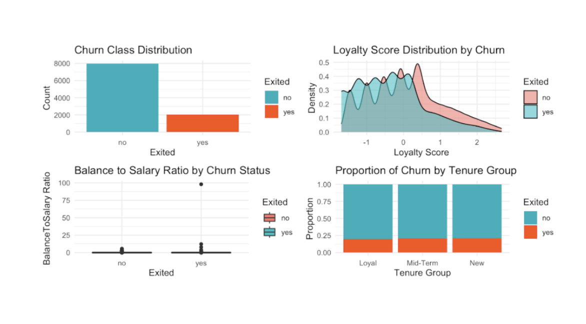

**Hi! I'm Jenna!**
## 🌟 **Welcome to my portfolio!**
I’m a Computer Science & Software Engineering student who loves blending code, design, and data to solve real-world problems. Here, you’ll find a mix of:

-  **Web Applications** – Interactive projects built with HTML, CSS, JS, and more.
-  **UI/UX Prototypes** – Figma designs showcasing thoughtful, user-centered experiences.
-  **Case Studies** – PDF write-ups of design, development, and data analysis work.
-  **Data Science Projects** – Analysis and visualizations that turn raw data into actionable insights.
-  **Database Design** – Well-structured relational models supporting efficient queries and scalability.
-  **SEO & Accessibility Revamps** – Including Dome website refreshes and improving search ranking and usability.

## **🌟 About Me**
<table border="0" cellspacing="0" cellpadding="0" style="border: none; border-collapse: collapse; width: 100%;>
<tr>
<td style="width: 30%; text-align: center;">

</td>
<td style="vertical-align: middle; width: 70%;">  
<ul>
  <li>Senior at Abilene Christian University (4.0 GPA)</li>
  <li>Junior Software Engineer & Project Manager at Dome Software</li>
  <li>NCAA Division I Cross Country & Track athlete</li>
  <li>Violinist & Pianist</li>
</ul>  
</td>
</tr>
</table>

## 🌟 **Let’s Connect**
- [LinkedIn](www.linkedin.com/in/jenna-keeley-0521512a8)  
- [Email](mailto:jmk21a@acu.edu)  
- [GitHub](https://github.com/jennamkeeley)

Thanks for visiting — feel free to explore my work and reach out if you want to collaborate!

## 🌟 **Featured Projects**

### 🚀 [Bank Customer Churn Prediction](https://github.com/jennamkeeley/bank-churn-ml)
**Tech:** R, tidyverse, caret, ggplot2, e1071, rpart, pROC  

**Overview:**  
Applied multiple machine learning algorithms to analyze 10,000+ banking customer records and identify key churn indicators.  

**Highlights:**  
- **85%+ accuracy** with kNN and CART models; **97.40% sensitivity** for churn detection.  
- Discovered **tenure, account balance, and activity level** as primary retention predictors.  
- Delivered interpretable, business-ready insights for targeted customer retention strategies.

  

  <a href="Customer Churn Analysis - Banking Sector.pdf">📄 View Project PDF</a>
  &nbsp;&nbsp;&nbsp;
  <a href="https://github.com/jennamkeeley/bank-churn-ml">💻 View GitHub Repo</a>

---

### 🚀 [Website Redesign Implementation – Dome Software](https://dome.software)
**Optimizing performance, accessibility, and SEO for a better user experience**

**Tech:** HTML, CSS, JavaScript, WAVE Extension, Google PageSpeed Insights, SEO tools, ADA compliance scanners

**Overview:**
Implemented a full homepage redesign for Dome Software based on provided Figma mockups. Ensured the new layout was fully responsive, optimized for speed, met ADA accessibility guidelines, and followed SEO best practices.

**My Responsibilities:**
- Translated static designs into clean, responsive HTML, CSS, and JavaScript
- Optimized images, scripts, and styles for faster load times
- Applied semantic HTML, meta descriptions, and structured content for SEO
- Validated accessibility compliance with WCAG 2.1 standards

**Results:** (Before → After)
- Performance: ~75% → 97% (+29%)
- Accessibility: ~95% → 100% (+5%)
- Best Practices: ~78% → 93% (+19%)
- SEO: ~82% → 92% (+12%)
- Reduced mobile render-blocking requests, improving page speed by >900 ms

<a href="Case Study — Dome Software Homepage Redesign Implementation.pdf">📄 View Project PDF</a>
  &nbsp;&nbsp;&nbsp;
  <a href="https://dome.software">💻 View Live Site</a>
