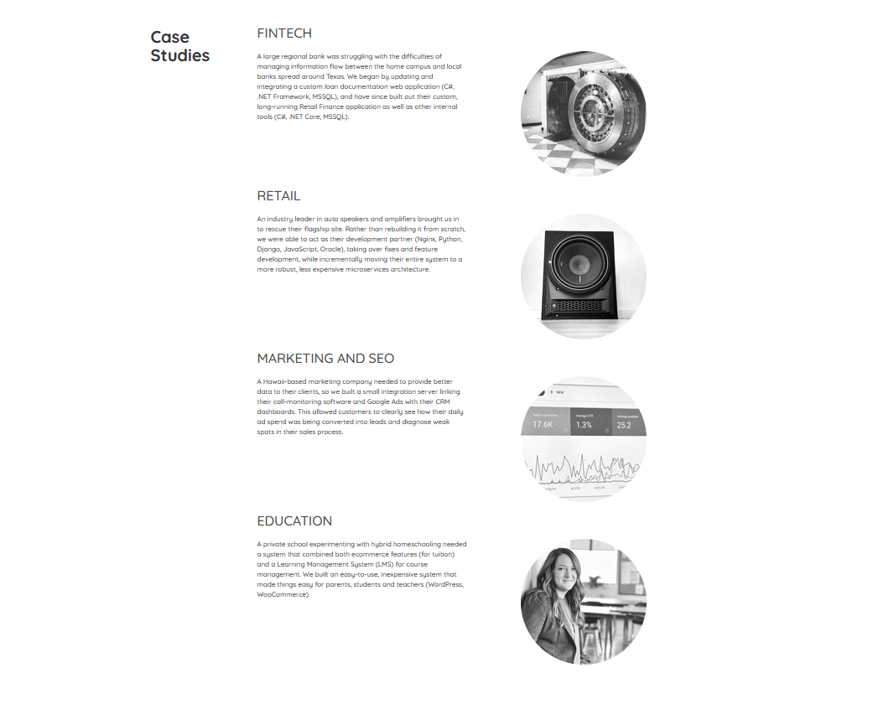
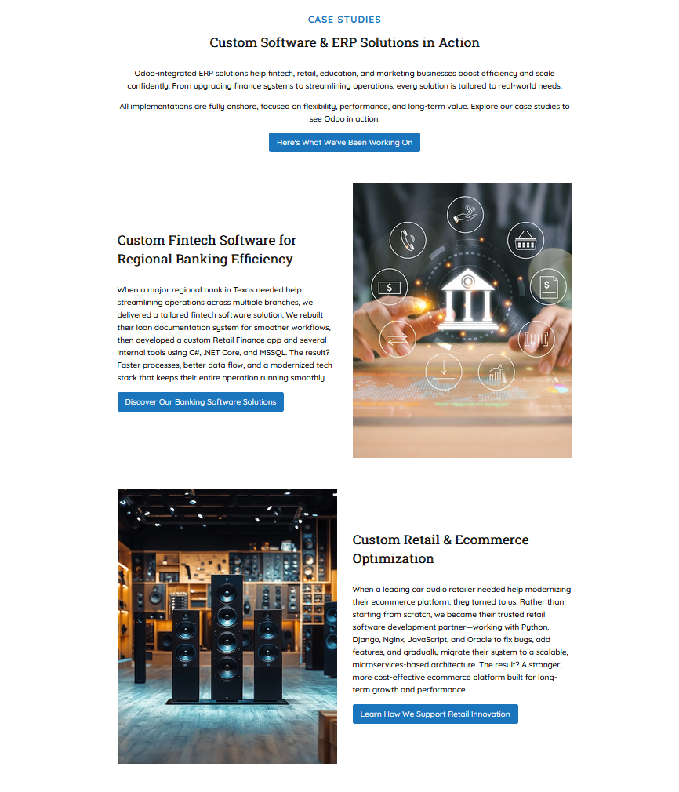

## 🌟 **Hi, I'm Jenna! Welcome to my portfolio!**
I’m a Computer Science & Software Engineering student who loves blending code, design, and data to solve real-world problems. Here, you’ll find a mix of:

-  **Web Applications** – Interactive projects built with HTML, CSS, JS, and more.
-  **UI/UX Prototypes** – Figma designs showcasing thoughtful, user-centered experiences.
-  **Case Studies** – PDF write-ups of design, development, and data analysis work.
-  **Data Science Projects** – Analysis and visualizations that turn raw data into actionable insights.
-  **Database Design** – Well-structured relational models supporting efficient queries and scalability.
-  **SEO & Accessibility Revamps** – Including Dome website refreshes and improving search ranking and usability.

## **🌟 About Me**

  

    
  

  

    <ul>
      <li>Senior at Abilene Christian University (4.0 GPA)</li>
      <li>Junior Software Engineer & Project Manager at Dome Software</li>
      <li>NCAA Division I Cross Country & Track athlete</li>
      <li>Violinist & Pianist</li>
    </ul>
  

## 🌟 **Featured Projects**

### 🚀 [Bank Customer Churn Prediction](https://github.com/jennamkeeley/bank-churn-ml)
**Tech:** R, tidyverse, caret, ggplot2, e1071, rpart, pROC  

**Overview:**  
Applied multiple machine learning algorithms to analyze 10,000+ banking customer records and identify key churn indicators.  

**Highlights:**  
- **85%+ accuracy** with kNN and CART models; **97.40% sensitivity** for churn detection.  
- Discovered **tenure, account balance, and activity level** as primary retention predictors.  
- Delivered interpretable, business-ready insights for targeted customer retention strategies.

  

  <a href="Customer Churn Analysis - Banking Sector.pdf">📄 View Project PDF</a>
  &nbsp;&nbsp;&nbsp;
  <a href="https://github.com/jennamkeeley/bank-churn-ml">💻 View GitHub Repo</a>

---

### 🚀 [Website Redesign Implementation – Dome Software](https://dome.software)
**Optimizing performance, accessibility, and SEO for a better user experience**

**Tech:** HTML, CSS, JavaScript, WAVE Extension, Google PageSpeed Insights, SEO tools, ADA compliance scanners

**Overview:**
Implemented a full homepage redesign for Dome Software based on provided Figma mockups. Ensured the new layout was fully responsive, optimized for speed, met ADA accessibility guidelines, and followed SEO best practices.

**My Responsibilities:**
- Translated static designs into clean, responsive HTML, CSS, and JavaScript
- Optimized images, scripts, and styles for faster load times
- Applied semantic HTML, meta descriptions, and structured content for SEO
- Validated accessibility compliance with WCAG 2.1 standards

<table align="center">
  <tr>
    <th>Before</th>
    <th>After</th>
  </tr>
  <tr>
    <td></td>
    <td></td>
  </tr>
</table>

**Results:** (Before → After)
- Performance: ~75% → 97% (+29%)
- Accessibility: ~95% → 100% (+5%)
- Best Practices: ~78% → 93% (+19%)
- SEO: ~82% → 92% (+12%)
- Reduced mobile render-blocking requests, improving page speed by >900 ms

<a href="Case Study — Dome Software Homepage Redesign Implementation.pdf">📄 View Project PDF</a>
  &nbsp;&nbsp;&nbsp;
<a href="https://dome.software">💻 View Live Site</a>
  
---

### 🚀 [Fitness Tracker App - UI/UX Design](Smartphone App Presentation.pdf)

**Tech:** Figma, GOMS-KLM (Goals, Operators, Methods, and Selection rules – Keystroke-Level Model), Usability Testing

**Overview:**
Designed a mobile fitness tracking application focused on intuitive navigation, quick goal setting, and user motivation. Created high-fidelity wireframes and interactive prototypes in Figma, incorporating iterative improvements after multiple rounds of usability testing. Applied GOMS-KLM analysis to predict and measure task completion times, validating that design changes led to faster, more efficient user interactions.

**Highlights:**
- Conducted 3+ rounds of moderated usability tests with feedback-driven revisions
- Improved predicted task times by streamlining navigation and reducing taps
- Designed for a balance of performance tracking, goal setting, and social sharing features
- Delivered interactive prototype optimized for iOS and Android

  <a href="https://www.figma.com/design/bFtp1raQJxOTi6Lgj663am/Smart-Watch-App?node-id=0-1&t=IDszTIFVDWY9qGov-1">💻 View All Mockup Screens</a>
  &nbsp;&nbsp;&nbsp;
  <a href="Smartphone App Presentation.pdf">📄 View Project Presentation</a>

  

**Task Flows**
- [🏃 View stats from a previous workout](https://www.figma.com/proto/bFtp1raQJxOTi6Lgj663am/Smart-Watch-App?node-id=0-1&t=IDszTIFVDWY9qGov-1)
- [🏃 Add a photo to a past activity & share it to social media](https://www.figma.com/proto/bFtp1raQJxOTi6Lgj663am/Smart-Watch-App?node-id=150-1026&t=IDszTIFVDWY9qGov-1)
- [🏃 Find & start a workout video](https://www.figma.com/proto/bFtp1raQJxOTi6Lgj663am/Smart-Watch-App?node-id=170-842&t=IDszTIFVDWY9qGov-1)
  
---

### 🚀 [Database Design – EasyDrive School of Motoring](https://github.com/jennamkeeley/normalized-database-design)  
**Designing and implementing a normalized relational database for efficient operations**  

**Tech:** MySQL, SQL Workbench, ER Diagram, Google Sheets 

**Overview:**  
Designed and implemented a normalized **3NF** relational database for a multi-location driving school. Created an ER diagram, implemented the schema in MySQL, populated it with realistic sample data, and wrote SQL queries to answer real operational questions such as staffing, scheduling, client outcomes, and mileage tracking.  

**My Responsibilities:**  
- Led ER Diagram design, ensuring relationships matched business rules  
- Documented and executed full normalization to 3NF  
- Created key tables in MySQL with constraints, indexes, and foreign keys  
- Wrote a majority of the SQL queries for operational and analytical use  

  

**Example Queries:**  
- Managers’ names and phone numbers per office  
- Female instructors in the Glasgow – Bearsden office  
- Timetable of appointments for a given instructor next week  
- Clients who passed the driving test in January 2013  
- Average miles driven during a one-hour lesson  

<a href="https://github.com/jennamkeeley/normalized-database-design/raw/main/Normalization.pdf">📄 View Normalization PDF</a>
  &nbsp;&nbsp;&nbsp;
<a href="https://github.com/jennamkeeley/normalized-database-design">💻 View GitHub Repo</a>  

---

### 🚀 [Market Research Tool – In Progress](#)  
**Leading development of a SaaS product for location-specific market intelligence**  

**Tech & Tools:** Trello, Slack, Figma, Google Workspace, HubSpot, Looker Studio  

**Overview:**  
Acting as Project Manager for the development of a market research platform that delivers location-specific insights for entrepreneurs, small businesses, and investors. The tool will compile demand, competition, economic indicators, and local growth metrics into a single, visually compelling report.  

**My Responsibilities:**  
- Defined MVP scope, core features, and success metrics  
- Coordinated between developers, marketing, and research teams to align timelines and deliverables  
- Managed task boards, sprint planning, and status updates in Trello  
- Developed early UI/UX wireframes in Figma and oversaw feedback iterations  
- Created data structure outline and prioritized feature backlog for phased rollout  

**Current Status:**  
- MVP target release: **[October 2025]**  
- Development in progress; front-end, report automation, and backend API integration underway  
- Preparing beta launch strategy and client onboarding plan  

  

**Planned Impact:**  
Upon launch, this tool will provide small businesses with data-driven insights to improve decision-making, reduce risk, and identify growth opportunities in their chosen markets.  

---

## 🌟 **Let’s Connect**
- [LinkedIn](www.linkedin.com/in/jenna-keeley-0521512a8)  
- [Email](mailto:jmk21a@acu.edu)  
- [GitHub](https://github.com/jennamkeeley)

Thanks for visiting — feel free to explore my work and reach. I'd love to hear from you and connect!
Jenna K.

